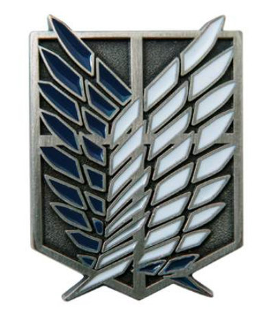
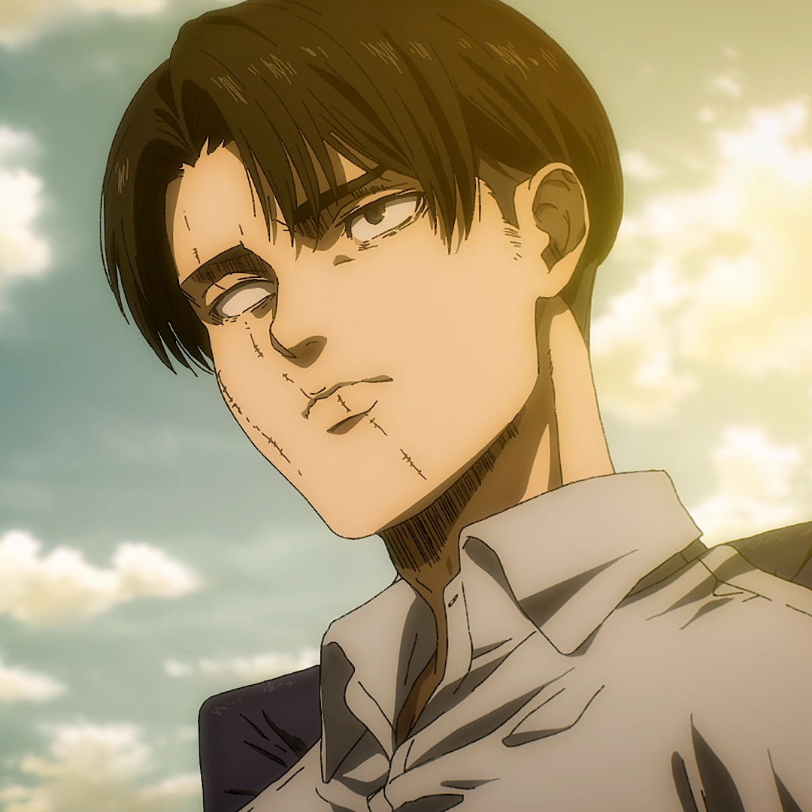
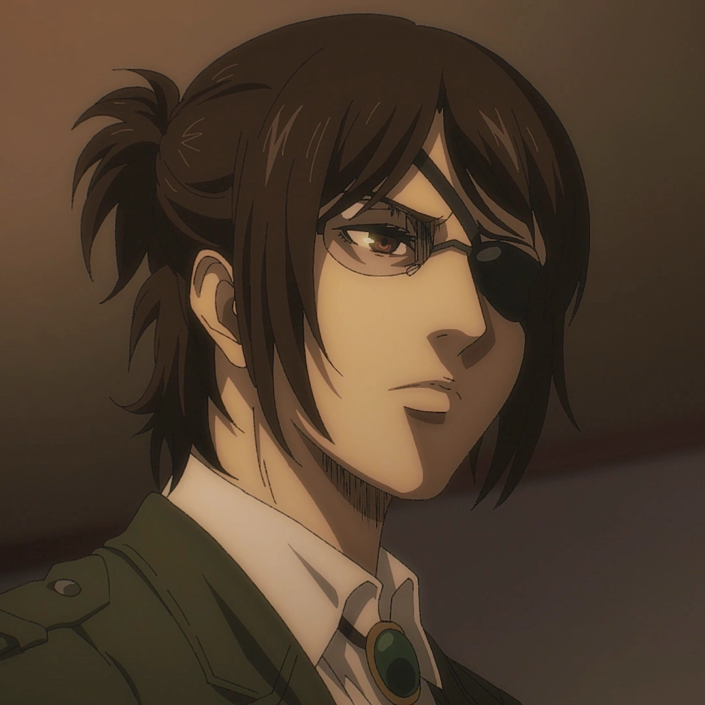
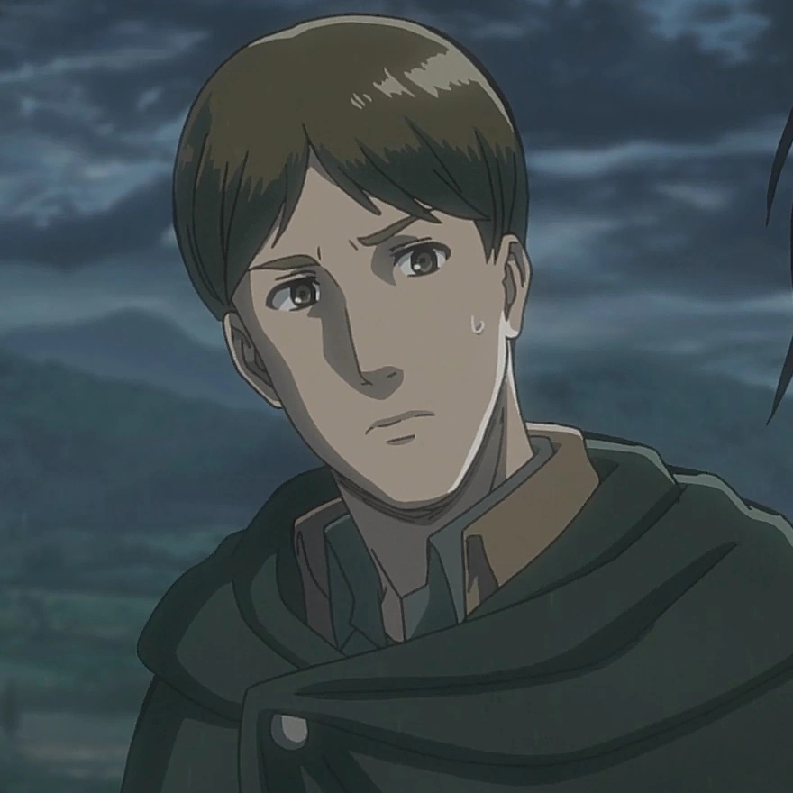
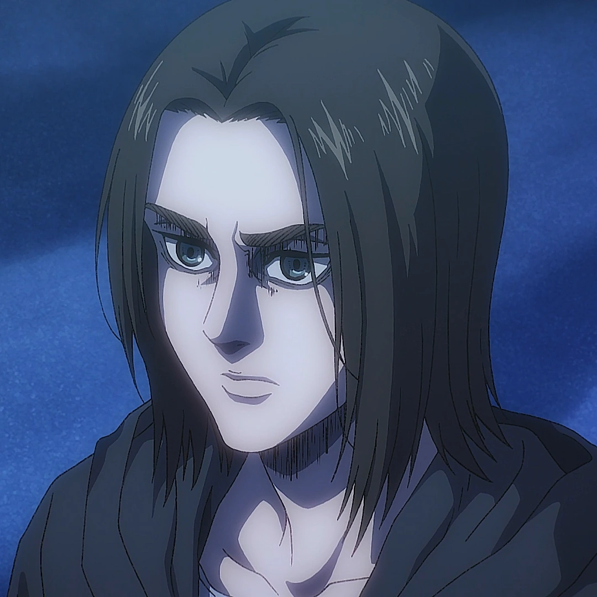
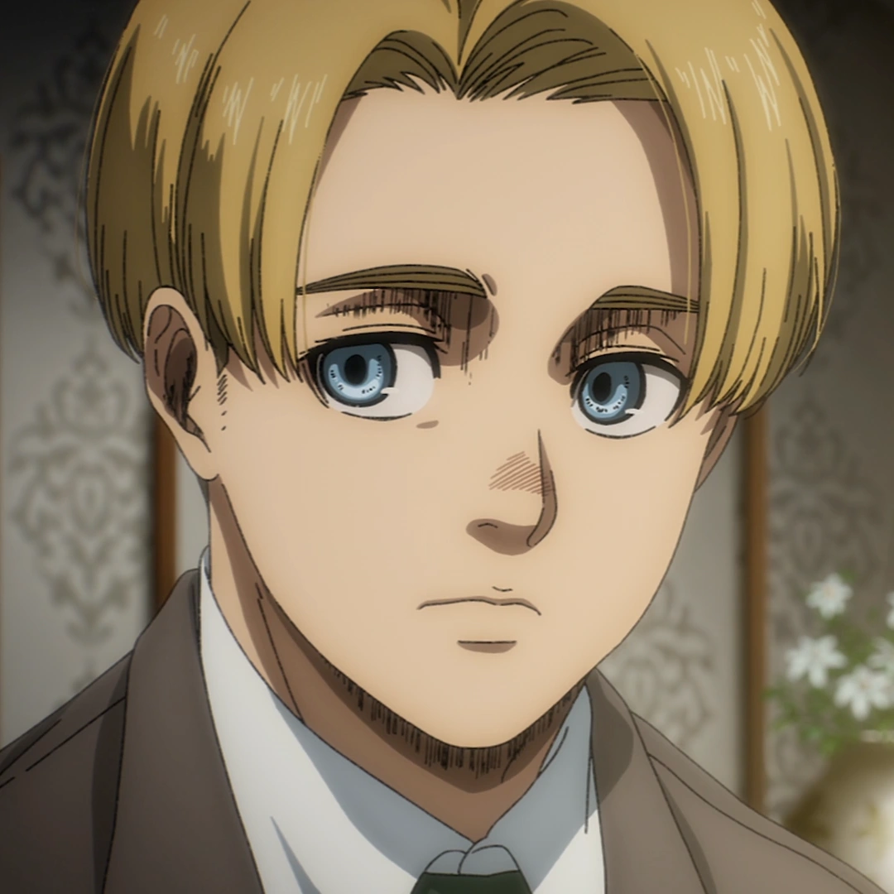
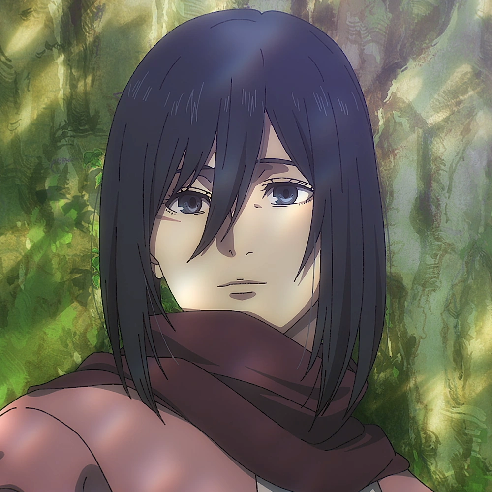
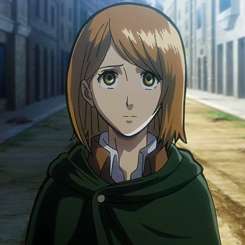
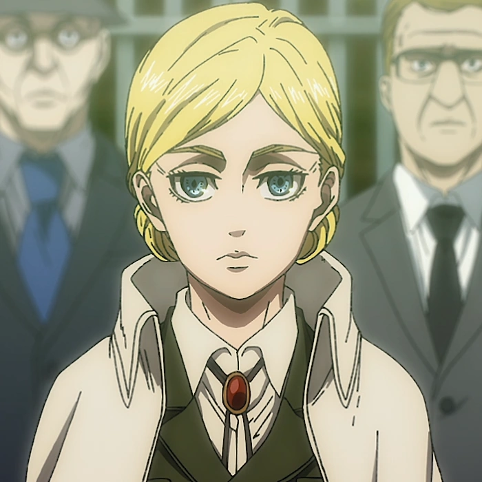
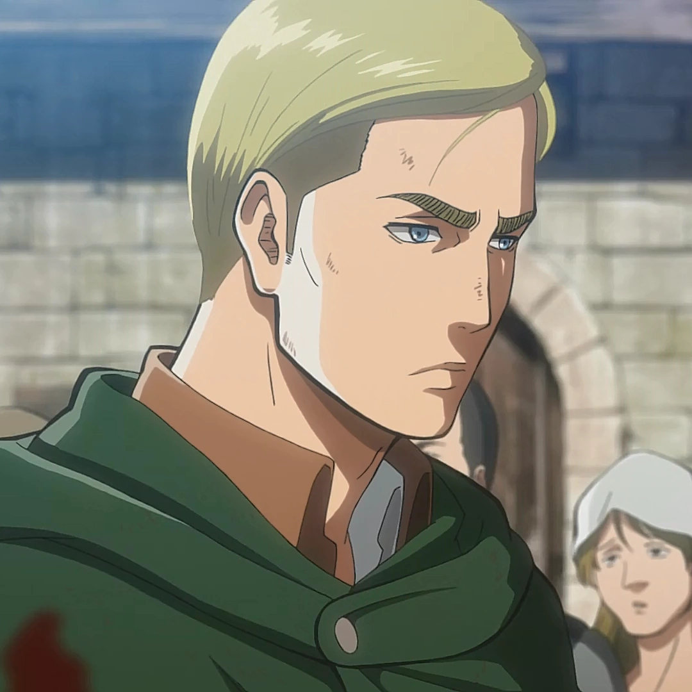

# Survey Corps 調查兵團

> An Attack on Titan-themed multi-agent market research team for Claude Code.
> 以《進擊的巨人》調查兵團為主題的 Claude Code 多代理市場研究團隊。

```
/levi 你的研究主題
```

**快速切換 / Quick Switch**: [English](#english) ・ [繁體中文](#繁體中文)

---

## English

### What Is This?

A **fun but production-grade** multi-agent team that conducts market research through parallel investigation and adversarial debate. Each agent is named after a member of the Survey Corps from *Attack on Titan* — Levi leads, Hange and Moblit investigate, Eren and Armin debate, Mikasa assesses, Petra inspects, Historia publishes, and Erwin reviews.

Under the hood it is a rigorous 6-phase workflow with source verification, multi-round debate, technical feasibility assessment, and multi-format report production (HTML / PPTX / PDF / DOCX). Above the hood it is the Survey Corps taking on market intelligence instead of Titans.

### Why a Theme?

- **Memorable roles.** "Who does the skeptic side of the debate?" → *Armin.* You never forget who owns what.
- **Clear hierarchy.** Levi commands. Everyone else executes. Flat, fast, unambiguous.
- **Fun to use.** `/levi "electric vehicle charging networks"` beats `/boss-coordinator-v3`.

### Quick Start

1. Install this directory as the project root (or copy into your repo).
2. Run inside Claude Code:
   ```
   /levi AI-powered customer service chatbot market feasibility
   ```
3. Levi runs the full 6-phase workflow and produces your report.

### Workflow

```
Phase 1  Intake & Planning          →  Levi
Phase 2  Data Collection (parallel) →  Hange ∥ Moblit
Phase 3  Independent Analysis       →  Eren ∥ Armin
Phase 4  Multi-Round Debate         →  Eren ↔ Armin (Levi moderates)
Phase 5  Technical Assessment       →  Mikasa
Phase 6  QC & Report Production     →  Petra → Historia
Post     Process Retrospective      →  Erwin
```

### Meet the Squad



#### Levi — Coordinator
Humanity's strongest soldier and captain of the elite Special Operations Squad. As your coordinator, Levi plans research dimensions, dispatches the squad, moderates the debate, enforces phase gates, and accepts nothing short of clean execution. Zero tolerance for uncited claims or sloppy reports. Entry point: `/levi`.



#### Hange — Lead Investigator
The Survey Corps' obsessive researcher, eventually its 14th commander. As lead investigator, Hange runs parallel web research on assigned dimensions, verifies every source, and produces the primary Evidence Dossier. Curiosity weaponized — no fact too small, no rabbit hole too deep.



#### Moblit — Second Investigator
Hange's loyal assistant and the reason Hange survived half their experiments. Methodical and thorough, Moblit handles the remaining research dimensions with calm discipline. Writes everything down. Never loses a source.



#### Eren — Affirmative Debate Analyst
The soldier who charges forward. Eren takes the affirmative stance in Phase 4 — building the evidence-backed case for *why this opportunity is viable, and why now*. Relentless conviction paired with honest risk assessment.



#### Armin — Skeptic Debate Analyst
The strategist who asks the uncomfortable questions. Armin takes the opposing stance — identifying hidden risks, challenging optimistic projections, and exposing where the evidence is thin. His weapon is foresight.



#### Mikasa — Technical Assessor
Ackerman-born and the Scout Regiment's strongest soldier after Levi. Mikasa evaluates technical feasibility: technology maturity, implementation complexity, integration risk, scalability. Where Eren charges forward with conviction, Mikasa judges what will actually hold.



#### Petra — Quality Inspector
Veteran of Levi's elite squad, known for her precision and dedication. Petra runs the QA gate: every citation validated, every fabricated source flagged, every deliverable measured against the standard. Nothing ships unless it's clean.



#### Historia — Report Producer
From cadet to queen — Historia is the public face. She compiles approved deliverables into the final feasibility report across every requested format (HTML, PPTX, PDF, DOCX), preserving every source citation along the way.



#### Erwin — Process Reviewer
The 13th commander and strategic mind of the Survey Corps. Post-project, Erwin reviews how the squad executed — communication quality, workflow adherence, missed opportunities, scope drift. His retrospective shapes every future campaign.

> **Images**: Drop character portraits into `assets/characters/{name}.png` (e.g. `levi.png`, `hange.png`). All references above use relative paths so you can ship the folder with your preferred artwork.

### Design Philosophy

- **Evidence chain.** Every factual claim traces back to a verified source (rating 3.0+). Unsourced claims are QA violations.
- **Adversarial debate.** Feasibility is tested by Eren vs. Armin, not assumed. Both must cite, concede, and acknowledge risks.
- **Flat architecture.** One coordinator (Levi) directly manages all specialists. No sub-coordinators.
- **Worklog as memory.** Every phase writes `references.md → findings.md → decisions.md`. Context survives compression and session resets.

---

## 繁體中文

### 這是什麼？

一個**有趣但不馬虎**的多代理市場研究團隊，透過平行調查與正反辯論完成市場研究。每位成員都以《進擊的巨人》調查兵團角色命名 —— 里維指揮、漢吉與莫布里特調查、艾倫與阿爾敏辯論、米卡莎評估、佩托拉品管、希絲特莉亞出版、艾爾文檢討。

底層是嚴謹的六階段工作流：來源驗證、多輪辯論、技術可行性評估、多格式報告產出（HTML / PPTX / PDF / DOCX）。表層是調查兵團出任務 —— 只是這次獵物不是巨人，是市場情報。

### 為什麼用主題？

- **角色好記。** 「誰負責辯論的反方？」→ *阿爾敏。* 永遠不會搞混誰負責什麼。
- **階層清晰。** 里維指揮，其他人執行。扁平、快速、不拖泥帶水。
- **用起來有趣。** `/levi "電動車充電網路"` 比 `/boss-coordinator-v3` 有靈魂。

### 快速開始

1. 把這個資料夾當作專案根目錄（或複製進你的 repo）。
2. 在 Claude Code 內執行：
   ```
   /levi AI 客服聊天機器人市場可行性評估
   ```
3. 里維會跑完完整六階段流程並交付報告。

### 工作流程

```
階段 1  需求盤點與規劃        →  里維
階段 2  資料蒐集（平行）       →  漢吉 ∥ 莫布里特
階段 3  獨立分析              →  艾倫 ∥ 阿爾敏
階段 4  多輪辯論              →  艾倫 ↔ 阿爾敏（里維主持）
階段 5  技術可行性評估         →  米卡莎
階段 6  品管與報告產出         →  佩托拉 → 希絲特莉亞
結案    流程回顧              →  艾爾文
```

### 認識小隊


#### 里維 — 統籌
人類最強士兵，特別作戰小隊隊長。身為統籌，里維負責規劃研究維度、派遣小隊、主持辯論、執行階段關卡，對「沒引用來源的聲明」與「草率的報告」零容忍。入口指令：`/levi`。


#### 漢吉 — 首席調查員
調查兵團的狂熱研究者，後來的第十四任團長。身為首席調查員，漢吉平行處理指派的研究維度，驗證每一個來源，產出主要的證據檔案。好奇心武器化 —— 沒有太小的事實，沒有挖不完的兔子洞。


#### 莫布里特 — 第二調查員
漢吉的副手，也是漢吉能活著完成一半實驗的原因。莫布里特沉穩而徹底，處理剩下的研究維度。什麼都寫下來，從不弄丟來源。


#### 艾倫 — 正方辯論分析師
永遠往前衝的士兵。艾倫在階段 4 擔任正方 —— 建構有證據支撐的論述：**為什麼這個機會可行，而且必須是現在**。不退縮的信念，搭配誠實的風險評估。


#### 阿爾敏 — 反方辯論分析師
那個會問出「不舒服的問題」的策略家。阿爾敏擔任反方 —— 指出隱藏風險、挑戰樂觀預測、揭露證據薄弱之處。他的武器是遠見。


#### 米卡莎 — 技術評估員
阿卡曼血統，調查兵團僅次於里維的最強士兵。米卡莎評估技術可行性：技術成熟度、實作複雜度、整合風險、可擴展性。艾倫帶著信念往前衝，米卡莎則判斷什麼真正撐得住。


#### 佩托拉 — 品管檢查員
里維特別作戰小隊的資深成員，以精準與專注著稱。佩托拉把關品質：每一個引用都驗證、每一個假來源都標記、每一份交付物都對照標準。不乾淨不出貨。


#### 希絲特莉亞 — 報告產出
從新兵到女王 —— 希絲特莉亞是對外的門面。她把通過品管的內容編成最終可行性報告，並依需求產出所有格式（HTML、PPTX、PDF、DOCX），全程保留每一個來源引用。


#### 艾爾文 — 流程審查員
第十三任團長，調查兵團的戰略頭腦。專案結束後，艾爾文檢討整個小隊的執行：溝通品質、工作流程遵循度、錯失機會、範疇漂移。他的檢討報告形塑下一場戰役。

> **人物圖片**：把角色圖放進 `assets/characters/{英文名}.png`（例如 `levi.png`、`hange.png`）。上面所有引用都用相對路徑，你可以用自己的配圖直接替換。

### 設計理念

- **證據鏈。** 每一條事實聲明都必須追溯到可信度 3.0 以上的驗證來源。沒有引用就是品管違規。
- **對抗性辯論。** 可行性是艾倫和阿爾敏對辯「辯」出來的，不是假設出來的。雙方都必須引用、讓步、承認風險。
- **扁平架構。** 一個統籌（里維）直接管理所有專才，沒有二級協調者。
- **Worklog 作為記憶。** 每個階段都寫 `references.md → findings.md → decisions.md`。Context 被壓縮或 session 重啟後都能無縫續作。

---

## Project Structure 專案結構

```
market-research/
├── CLAUDE.md              ← Team-wide instructions / 團隊共通規範
├── README.md              ← This file / 本檔案
├── .claude/
│   ├── agents/            ← 9 Survey Corps members
│   │   ├── levi.md
│   │   ├── research/      (hange, moblit)
│   │   ├── analysis/      (eren, armin, mikasa)
│   │   ├── output/        (petra, historia)
│   │   └── review/        (erwin)
│   ├── skills/
│   │   ├── levi/          ← Entry point skill (/levi)
│   │   ├── debate-protocol/
│   │   ├── source-verification/
│   │   ├── web-research/
│   │   └── {ui-ux,pptx,pdf,docx}/
│   └── rules/
├── .worklog/              ← Evidence chain per phase
├── output/                ← Generated reports
└── assets/characters/     ← Character portraits (drop your own)
```

## License

MIT. *Attack on Titan* characters and likenesses © Hajime Isayama / Kodansha — used here as thematic fan tribute, not affiliated with or endorsed by the original creators.
